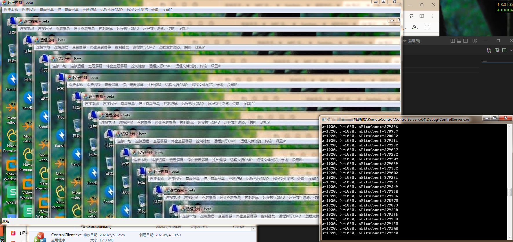
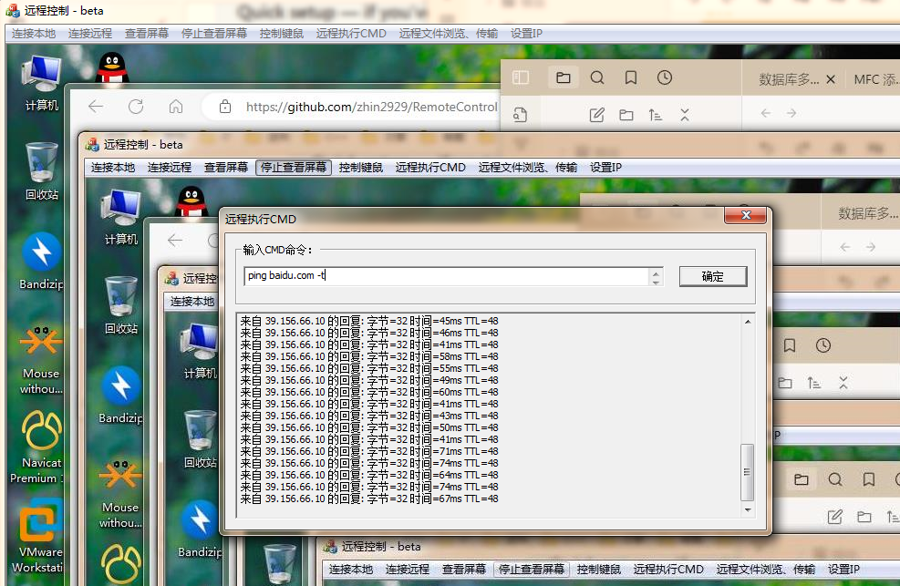
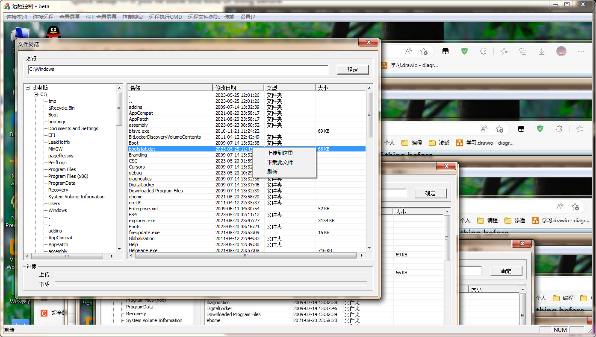

# RemoteControl 

使用 MFC 框架和 Socket TCP 协议实现的一个远程桌面控制软件。

其中服务端用到了 Select 模型支持多客户端连接。

主要功能有：
1. 支持远程执行CMD命令
2. 支持查看远程屏幕，控制远程主机键盘和鼠标
3. 支持远程上传和下载文件

## 如何使用：
编译好项目后，先启动服务端程序，控制台会出现3条输出等待连接。

然后启动客户端，如果是测试可以先连接本地，也就是当前电脑，但是无法使用鼠标控制，因为进入到客户端界面的鼠标会被转换成当前电脑屏幕位置。

如果是连接远程电脑，先点击菜单的设置IP。